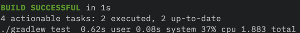

Running best case no overhead or auxiliary issues   
    - M1 Mac  
    - GraalVM 22.3.0 CE (latest community edition)

### ./gradlew nativeTest (graal)

57 seconds to get feedback 

### ./gradlew nativeBuild (graal)

45 seconds 

### ./gradlew test (jvm)

1.8 seconds 

### ./gradlew shadowJar (jvm)

2.4 seconds   

### Scenario of adding a new feature/dependency Kafka

Have to use the micronautified version (smaller community, support etc) and be extra careful that the libs you bring in are compatible with GraalVM. Micronaut does support Kafka at least

Micronaut Kafka dependency (blocked internally)  
`implementation("io.micronaut.kafka:micronaut-kafka")`

`docker compose up` to spin up local kafka from docker-compose.yml

Now lets follow the docs to [add a kafka producer](https://docs.micronaut.io/latest/guide/index.html#kafkaProducer)

See ProductClient/HomeController

Now this is ok and works for now, but what happens when we go to native image mode?

Build time to 1 minute 14s   
This is all before adding a single line of our own app code

due to the kafka dependency

Below issues are also worrying  
https://github.com/micronaut-projects/micronaut-kafka/issues/264
https://github.com/micronaut-projects/micronaut-kafka/issues/468

##### How long is JVM mode taking now?

3.7 seconds 

### Another feature, this time caching with redis

`implementation("io.micronaut.redis:micronaut-redis-lettuce")`

I would have preferred Jedis client but micronaut only supports lettuce. Not major issue.

Everything looks good in JVM mode, I may have spent a long time in JVM world testing things out.

Build time took 1m 5s little shorter? CPU caching?

JVM compile time still only at 3.75s 

What is this on the micronaut [tutorial page?](https://micronaut-projects.github.io/micronaut-redis/latest/guide/#graalvm), is something going to blow up at runtime?

## **Oh. this is why https://github.com/lettuce-io/lettuce-core/issues/1316**

### What are you trying to prove

There is too much to think about to get simple things working. 

GraalVM feels too experimental at the moment. Having to be extra careful on every library we use and the lack of community support is worrying.

#### SAM CLI 

todo, every build/deploy in 'proper' local environment requires rebuild, too slow
